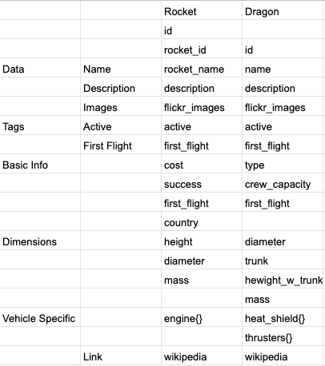

# Rockets and Dragons

Application is deployed [**here**](http://rockets-and-dragons.surge.sh/)


## Specification

Create an application that provides a brief overview of SpaceX's _rockets_ and _dragons_. 🚀  🛰 that meets the following requirements:

- Fetch and render a list of _rockets_ or _dragons_ from SpaceX's API.
  
- Show extended information about a selected list item in a separate box, modal or page.

## How to run this application

* Clone and open the repository

* Install dependencies ```yarn```
  
* Run the project  ```yarn test```

* Start the project  ```yarn start```

* Visit [localhost:3000](http://localhost:3000)

## What I used to build the app

* **Language**: JavaScript

* **Framework**: React

* **Boilerplate**: `create-react-app`

* **API calls**: [axios](https://github.com/axios/axios)

* **Styling**: [Styled Components](https://styled-components.com/)

* **Testing**: [Enzyme](https://github.com/enzymejs/enzyme) and [Jest](https://github.com/facebook/jest)

* **Other** [Marshmallow S'Mores](https://github.com/marshmallow-insurance/smores-react)

## How I approached building the app

I started by visiting the endpoints of the SpaceX API and comparing the rocket data with the dragon data to get a better understanding of the types of information that I had access to. I then made a list of each item that I thought would be relevant to the application.



Once I had a clear idea of what I wanted to display I began to plan the structure of the application. As I was rendering a similar set of information for each vehicle I wanted to make my components as modular as possible. I feel I have done this successfully with the creation of Item and InfoSheet Components. I decided to create separate Dragon and Rocket components to help in handling the data.

I used Marshmallow's S'Mores components and Styled Components to style the application to try and remove visual inconsistencies wherever possible.

I have tested the basic rendering of each component. I am particularly happy with the testing of the calls to the API. Given more time, I would like to improve the test coverage of the application further.

## How I aim to improve the app

* Improve test coverage
* Create a function that will handle the data a little better to remove the need for a separate Rocket and Dragon Module
* Add the Wikipedia link to the more-info section
* Add images section to more-info
* Make site responsive to different screen sizes